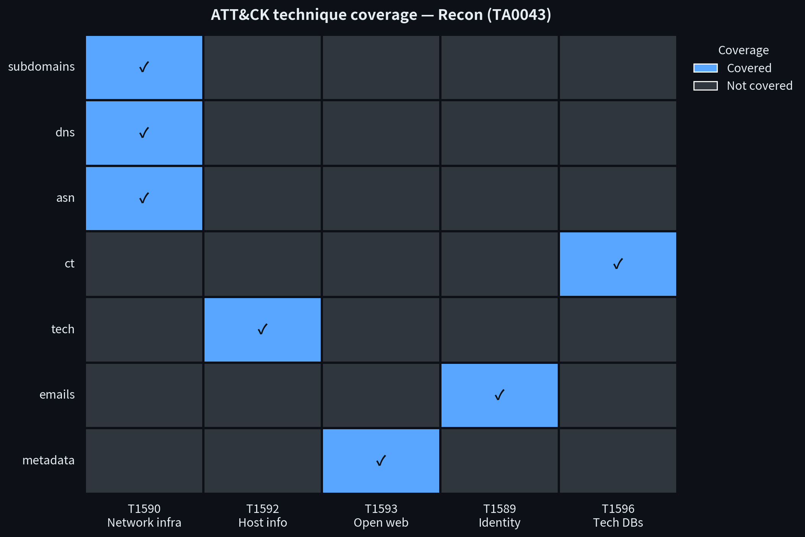
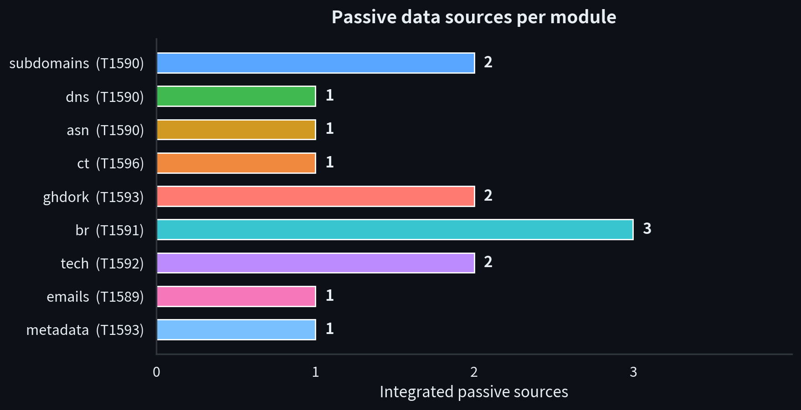
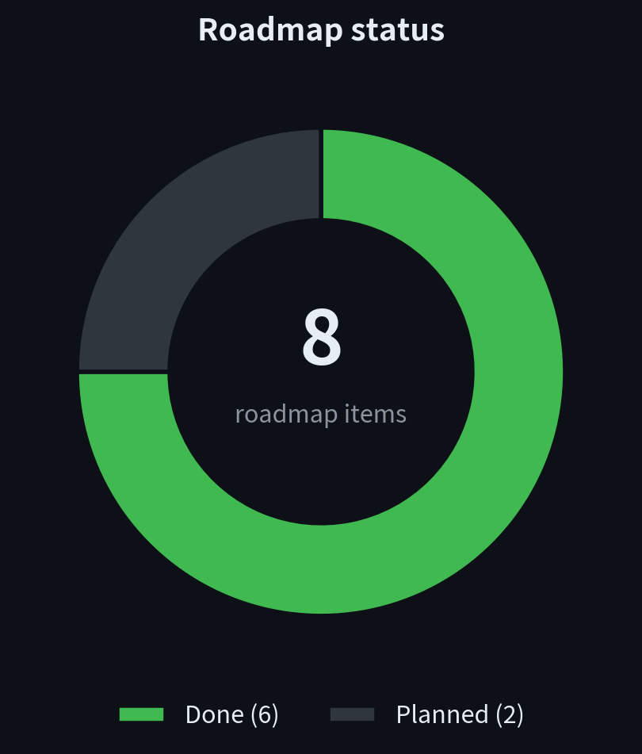

# osint-recon

**Passive OSINT reconnaissance framework in Rust for authorized red team engagements.**

[](https://attack.mitre.org/tactics/TA0043/)
[](https://github.com/JMarchiori13/osint-recon/actions/workflows/ci.yml)
[](https://www.rust-lang.org/)
[](LICENSE)

> **⚠️ DISCLAIMER — FOR AUTHORIZED SECURITY ASSESSMENTS ONLY**
>
> This tool is intended for security research, education, and red team
> engagements performed with **explicit written authorization** from the
> target's owner. Unauthorized reconnaissance against third-party systems may
> violate applicable law, including **Brazil's Lei nº 12.737/2012** and the
> **U.S. Computer Fraud and Abuse Act (CFAA)**. Collected personal data is
> additionally subject to **LGPD/GDPR**. You are solely responsible for how
> you use this software. The author assumes no liability for misuse.

## Overview

`osint-recon` automates the **passive** portion of MITRE ATT&CK
Reconnaissance (TA0043): certificate transparency, DNS-over-HTTPS, keyless
public aggregators, and plain GET requests to already-public pages. It
deliberately contains **no active capabilities** — no port scanning, no
directory or subdomain brute forcing, no credential testing.

Every module shares a single HTTP client with polite rate limiting
(1 req/s default), user-agent rotation, timeouts and bounded retries; every
external call fails gracefully (warn & continue) and results export to JSON
and CSV.

## Features

- 🔎 **Subdomain enumeration** from certificate transparency (crt.sh) and DNS-history aggregators (hackertarget) — keyless, passive
- 🌐 **DNS records** (A, AAAA, MX, NS, TXT) via DNS-over-HTTPS (dns.google) without touching the target's nameservers
- 🗺️ **ASN & netblock enumeration** via Team Cymru DNS whois over DoH — IP→ASN, AS name, announced prefix
- 📜 **Certificate transparency history** — aggregated crt.sh view: issuers, validity windows, certs expiring in <30 days
- 🐙 **GitHub dorking** — repos/users mentioning the domain keyless; optional token tier adds code-search dorks (`.env`, configs, `password`/`api_key`)
- 🧬 **Technology fingerprinting** from response headers, meta generator tags and CMS/framework signatures
- 📧 **Email harvesting** from pages the organization itself publishes, labeled for authorized phishing-simulation planning
- 📄 **PDF metadata extraction** (author, creator tool, dates) from publicly linked documents
- 📤 **JSON + CSV export** and formatted console tables
- 🐢 **Polite by design**: 1 req/s throttle, UA rotation, timeouts, retries, bounded page/PDF limits

## Installation

### Build from source

```sh
git clone https://github.com/JMarchiori13/osint-recon.git
cd osint-recon
cargo build --release
# binary at ./target/release/osint-recon
```

### Install into Cargo's bin directory

```sh
cargo install --path .
osint-recon --help
```

Requires Rust 1.95+ (earlier stable toolchains will likely work; only 1.95 is tested).

## Usage

```sh
# Passive subdomain enumeration (CT logs + DNS history)
osint-recon subdomain example.com

# DNS records via DNS-over-HTTPS
osint-recon dns example.com

# Technology fingerprinting (headers + HTML signatures)
osint-recon tech example.com

# Email addresses published on the target's own pages (authorized use only)
osint-recon email example.com

# Metadata from publicly linked PDFs
osint-recon metadata example.com

# ASN & netblock enumeration (domain or bare IPv4)
osint-recon asn example.com
osint-recon asn 193.0.11.51

# Certificate transparency history summary
osint-recon ct example.com

# GitHub dorking (keyless: repos + users; with token: + code-search dorks)
osint-recon ghdork example.com
OSINT_RECON_GITHUB_TOKEN=ghp_... osint-recon ghdork example.com

# Everything at once, exported
osint-recon full example.com --json output/full.json
osint-recon dns example.com --csv output/dns.csv
```

Global options:

| Option | Default | Description |
|--------|---------|-------------|
| `--rate <rps>` | `1.0` | Politeness rate limit (requests/second) |
| `--timeout <s>` | `15` | Per-request timeout (seconds) |
| `--retries <n>` | `2` | Retries per request after the first attempt |
| `--json <file>` | — | Export results as JSON |
| `--csv <file>` | — | Export results as CSV (single-module runs) |
| `-q, --quiet` | — | Suppress the authorization banner |

## Modules & ATT&CK mapping

| Module | Sources | ATT&CK (passive only) |
|--------|---------|------------------------|
| `subdomain` | crt.sh, hackertarget hostsearch | T1590.001 — Domain Properties |
| `dns` | dns.google DoH JSON API | T1590.002 — DNS |
| `asn` | Team Cymru DNS whois (via DoH) | T1590.001 / T1590.005 — Domain Properties / IP Addresses |
| `ct` | crt.sh certificate transparency logs | T1596.003 — Search Open Technical Databases: Digital Certificates |
| `ghdork` | GitHub REST search API (keyless + optional token tier) | T1593.003 — Search Open Websites/Domains: Code Repositories |
| `tech` | homepage headers + HTML signatures | T1592.002 — Software |
| `email` | public pages (bounded link following) | T1589.002 — Email Addresses, T1593.002 |
| `metadata` | publicly linked PDFs (lopdf Info dict) | T1593.002 — Search Open Websites/Domains |

See [docs/modules.md](docs/modules.md) for per-module output fields and
limitations, and [docs/methodology.md](docs/methodology.md) for the full
methodology and OPSEC notes. Safe practice targets are documented in
[docs/lab.md](docs/lab.md).

## Visualizations

<p align="center">
  
</p>

<p align="center">
  
</p>

<p align="center">
  
</p>

## Roadmap

- [x] ASN & netblock enumeration (passive, via public BGP/RIR data) — shipped in v0.2.0
- [x] Certificate transparency history & expiring-cert monitoring — shipped in v0.2.0
- [x] GitHub dorking module (code-search aggregators, keyless where possible) — shipped in v0.3.0
- [ ] Shodan API integration (key-based, passive host profiles)

## Project structure

```
osint-recon/
├── Cargo.toml
├── .github/workflows/
│   └── ci.yml                  # fmt / clippy -D warnings / test / release build
├── src/
│   ├── main.rs                 # clap CLI: subdomain/dns/asn/ct/ghdork/tech/email/metadata/full
│   ├── http.rs                 # shared client: UA rotation, timeout, retry, 1 req/s throttle
│   ├── output.rs               # JSON + CSV export, formatted console tables
│   └── modules/
│       ├── mod.rs
│       ├── crtsh.rs            # shared crt.sh CT-log fetch helper
│       ├── subdomains.rs       # crt.sh + hackertarget (keyless passive sources)
│       ├── dns_records.rs      # DNS-over-HTTPS via dns.google (A/AAAA/MX/NS/TXT)
│       ├── asn.rs              # Team Cymru DNS whois over DoH (IP→ASN, prefix, AS name)
│       ├── ct_history.rs       # crt.sh aggregate: issuers, validity, expiring certs
│       ├── github_dorks.rs     # GitHub REST search: repos/users keyless, code dorks w/ token
│       ├── tech_fingerprint.rs # headers + meta generator + CMS/framework signatures
│       ├── emails.rs           # regex harvest from the domain's public pages
│       └── doc_metadata.rs     # public PDF links → Info-dict metadata via lopdf
├── docs/
│   ├── methodology.md          # passive recon methodology, ATT&CK mapping, OPSEC
│   ├── modules.md              # per-module sources, output fields, limitations
│   └── lab.md                  # safe testing targets and lab setup
├── tests/
│   └── cli.rs                  # network-free CLI integration tests
├── CONTRIBUTING.md
├── LICENSE                     # MIT + research-use notice
└── README.md
```

## Development

```sh
cargo fmt --check
cargo clippy --all-targets
cargo test --release
cargo build --release
```

Contributions are welcome — see [CONTRIBUTING.md](CONTRIBUTING.md). The
**passive-only scope is non-negotiable**: PRs adding scanning, brute forcing
or credential testing will be rejected.

## License

[MIT](LICENSE) © 2026 JMarchiori13 — see the research-use notice in the
LICENSE file and the disclaimer above.
